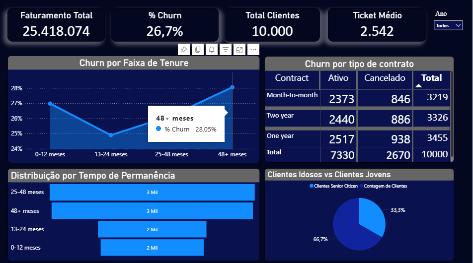

📊 Análise de Churn – Bank Customers
📌 Sobre o Projeto

Este projeto tem como objetivo analisar o comportamento de clientes e identificar padrões relacionados ao churn (cancelamento de clientes).

A análise foi desenvolvida utilizando consultas em SQL para extração e tratamento dos dados, e o Power BI para modelagem, criação de métricas em DAX e construção do dashboard interativo.

🎯 Objetivos da Análise

Calcular a taxa de churn (%)

Identificar o perfil de clientes que cancelaram

Analisar churn por idade, saldo, tempo de relacionamento

Gerar insights estratégicos para retenção de clientes

🛠️ Tecnologias Utilizadas

SQL

Power BI

DAX

Modelagem de Dados

📊 Métricas Desenvolvidas

Total de Clientes

Clientes Ativos

Clientes Inativos

% Churn

Ticket Médio

📈 Principais Análises

Taxa Geral de Churn

A base analisada possui 10.000 clientes, com uma taxa geral de churn de 26,7%, o que representa aproximadamente 2.670 clientes que cancelaram o serviço.

Esse percentual indica um nível relevante de evasão, impactando diretamente a receita e reforçando a necessidade de estratégias de retenção.

 Churn por Tempo de Relacionamento (Tenure)

Clientes com 0–12 meses apresentaram maior concentração de cancelamentos, indicando risco elevado no início da jornada do cliente.

Também foi observado aumento de churn em clientes com mais de 48 meses, sugerindo possível desgaste no relacionamento de longo prazo.

 Churn por Tipo de Contrato

O contrato de one year apresentou maior taxa de churn entre os tipos analisados, indicando que contratos intermediários podem não estar gerando retenção suficiente.

 Perfil Etário

Clientes mais jovens apresentaram maior taxa de churn, sugerindo maior propensão à troca de serviço ou sensibilidade a preço.

 Ticket Médio

Considerando o ticket médio de 2.542 e 2.670 clientes cancelados, estima-se um impacto potencial de aproximadamente 6,7 milhões em receita associada ao churn, 
reforçando a relevância estratégica da retenção de clientes.

📊 Dashboard

O dashboard foi desenvolvido para fornecer uma visão estratégica e interativa sobre o cancelamento de clientes.

📂 Estrutura do Projeto
📁 sql → Consultas utilizadas na análise  
📁 images → Imagens do dashboard  
📄 dashboard.pbix → Arquivo do Power BI  
📄 README.md → Documentação do projeto  
🚀 Próximos Passos

Aplicar modelo preditivo de churn utilizando Python

Criar segmentação de clientes por clusterização

Implementar análise exploratória mais aprofundada

👨‍💻 Autor

Pedro Henrique Gonçalves Garcia
Estudante de Análise e Desenvolvimento de Sistemas
Foco em Data Analytics
